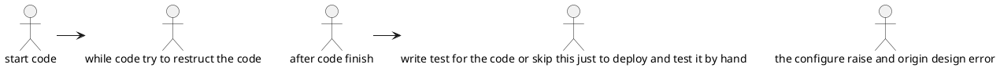
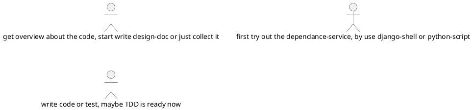

+++
title = "dirty-quick-and-tidy-it"
author = ["hackrole"]
date = 2021-05-10
lastmod = 2021-05-12T00:26:56+08:00
tags = ["programming", "thinking", "thinking"]
draft = false
+++

## backend {#backend}

the failure in manager knobs project, A project for the dirty work.

## the reason {#the-reason}

### workflow error {#workflow-error}

the bad workflow

the maybe-bettter workflow

the reason for this is forget to do research, the dirty work maybe superise you in any ways.
write code too fast may fail you. first try to play with it, after you collection all need-blocks, the coding will be enjoyable.

## something considable {#something-considable}

### maybe literate-programming?? {#maybe-literate-programming}

### start TDD very early may seems hard, better and research and play-around, it may be much easier. {#start-tdd-very-early-may-seems-hard-better-and-research-and-play-around-it-may-be-much-easier-dot}
